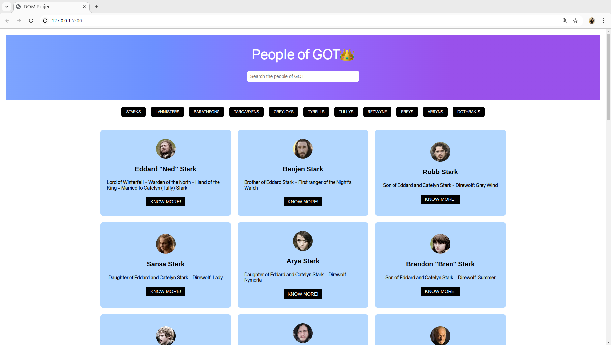

# Game of Thrones Character Search and Tab Navigation

## [Visit the project](https://startling-biscotti-b6fd34.netlify.app/)

This project is a simple web application built using HTML, CSS, and JavaScript that allows users to search for Game of Thrones (GOT) characters and filter them using tabs based on different names. The application provides a dynamic user interface with search functionality.

## Features

- **Search Functionality**: Allows users to search for GOT characters by name.
- **Tab Navigation**: Users can navigate between different name groups  to view characters grouped by categories.
- **Responsive Design**: The web page is responsive and adjusts based on the screen size to provide an optimal viewing experience across devices.

## Technologies Used

- **HTML**: For creating the structure of the page.
- **CSS**: For styling and layout.
- **JavaScript**: For adding interactivity, including the search and tab-switching functionality.
